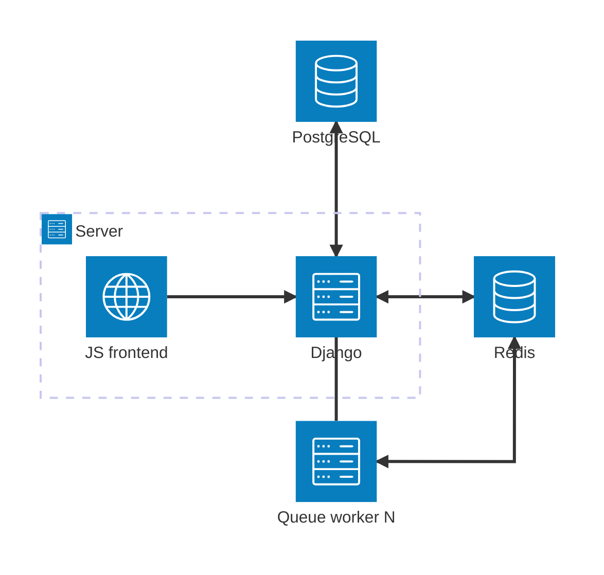

# Architecture of Kelvin
Kelvin consists of several interconnected services:

- Kelvin web
  - Django 4 application that provides a REST API and also a set of user-facing web pages and 
    templates
  - It renders some part of the web using a JavaScript frontend
- JavaScript frontend
  - Reactive frontend implemented using Svelte 3, which is rendered into a single JS and CSS file
  and served by the Django app.
- PostgreSQL database
  - Provides persistent storage of users, classes, subjects etc. for the web
- Redis
  - Provides a temporary (non-persistent) cache used for e.g. storing code plagiarism detection 
    check results

The web also uses RQ (Redis) queues for executing various jobs. There are three queues:
- `default` queue performs jobs related to code plagiarism detection
- `evaluator` queue performs evaluations of code submitted by students
  - The evaluation logic is implemented in the `evaluator` directory
  - It uses Docker internally to perform various evaluation pipelines
- `cuda` queue also performs evaluation, but it should be used for code that needs an NVIDIA GPU

Here is a simple diagram that describes the architecture:


## Directory structure
```
kelvin
├── api - REST API of the backend
├── evaluator - evaluation pipelines for checking submitted code
│   ├── images - docker images for custom pipeline actions
│   └── pipelines.py - integrated pipeline actions - e.g. Docker evaluation
│── frontend - JavaScript frontend
├── kelvin - base configuration of the application
├── survey - module for creating surveys defined in yaml
└── web - web interface for the kelvin web app
```
