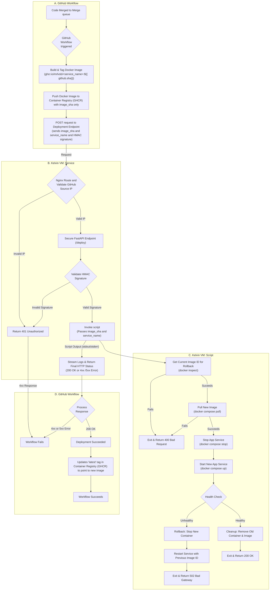

# Deployment

This document outlines the end-to-end flow for automatic on-premises deployment using GitHub Actions, Docker Compose, and a secured FastAPI deployment endpoint. It ensures minimal downtime by stopping only the target service after the new image is pre-pulled, with automatic rollback on failures.

## Workflow diagram



## Steps Description

### A. Merge Queue Trigger

- A pull request merged through the repository’s merge queue triggers the deployment workflow.

### GitHub Workflow

#### 1. **Build & Push Docker Image**

- Builds the Docker image and tags it with the unique commit SHA: `ghcr.io/mrlvsb/<service_name>:${{ github.sha }}`.
- Pushes the tagged image to the GitHub Container Registry (GHCR). At this point, the latest tag is not touched.

#### 2. **Call Deployment Endpoint**

- Computes an HMAC signature over the GitHub event payload using `WEBHOOK_SECRET`.
- Sends a `POST` request to the Kelvin VM’s `/deploy` with the `X-Hub-Signature-256` header and `image_sha` and `service_name` in request body.
- Uses `curl -f` to fail the Action on any non-200 response.


### B. Kelvin VM: Deployment Service

The deployment endpoint is not part of the main application. It is a small, separate, and secure service designed with a clear separation of concerns, running within its own Docker container.

#### 1. **Reverse Proxy (Nginx) & IP Whitelisting:**

The deployment service depends on a Reverse Proxy (Nginx), which acts as the single public-facing entry point on the server. This proxy is configured with a firewall or IP allowlist to ensure that only requests originating from official GitHub runner IP addresses are accepted. If a request comes from an unauthorized IP, it is immediately blocked with a `401 Unauthorized` status. For valid requests, Nginx routes them internally to the Deployment Service.

#### 2. **Deployment Service Container & HMAC Validation:**

This lightweight container runs the FastAPI endpoint. To manage deployments, it uses the `Docker-out-of-Docker` (DooD) concept: the host's Docker socket (`/var/run/docker.sock`) is mounted as a volume into this container. This allows script to issue `docker` and `docker compose` commands directly to the host's Docker daemon. As a second layer of security, this service validates the HMAC signature from the request header. If the signature is invalid, it returns a `401 Unauthorized` error.

#### 3. **Invoke Deployment Script:**

Upon successful IP and HMAC validation, the service invokes script, passing the `image_sha` and `service_name` as an argument.

#### 4. **Stream Logs & Return Status**

The service captures all output from the deployment script and includes it in the final HTTP response to GitHub Actions. This provides full visibility for debugging and returns the final status code from the script (e.g., `200`, `400`, `502`).


### C. Kelvin VM: Deployment Script

#### **1. Capture Rollback State & Pull New Image**

- The script first runs `docker inspect` on the currently running application container to get its exact image ID. This ID is stored as a reliable, stateful rollback target.

- It then attempts to pull the new image using `docker compose pull`. If the pull fails, the script immediately exits, returning a 400 Bad Request status without affecting the running service.


#### **2. Swap Service**

- If the pull succeeds:
    1. Stops the running service:
         ```bash
         docker compose stop <service_name>
         ```
    2. Starts the updated container (without dependencies):
         ```bash
         IMAGE_TAG=${image_sha} docker compose up -d --no-deps <service_name>
         ```

#### **3. Health Check**

- Validates the service's health using one of the following methods:
    - **Docker health status**:
        ```bash
        docker inspect --format='{{.State.Health.Status}}' <service_name>
        ```
    - **HTTP health probe** to verify the service's readiness.

- **If healthy**:
    - Returns `200 OK`.
    - Removes the old container and image to free up resources:
        ```bash
        docker compose rm -f <service_name>
        docker image rm ${PREVIOUS_IMAGE_ID}
        ```

- **If unhealthy**:
    - Rolls back by stopping the new container and restarting the previous version:
        ```bash
        docker compose stop <service_name>
        IMAGE_TAG=${PREVIOUS_IMAGE_ID} docker compose up -d --no-deps <service_name>
        ```
    - Returns a `5xx` response.

### D. GitHub Workflow

The GitHub Actions workflow waits for the HTTP response from the Kelvin Deployment Service.

- A `200 OK` response confirms the deployment was successful. The workflow proceeds to update the latest tag in GHCR to point to an image previously tagged by commit SHA (image_sha) and then marks the entire run as successful.

- Any other status code (`4xx` or `5xx`) marks the workflow as failed, providing clear and immediate feedback directly in the merge queue. The detailed logs returned from the deployment script are printed to the workflow output for diagnostics.
