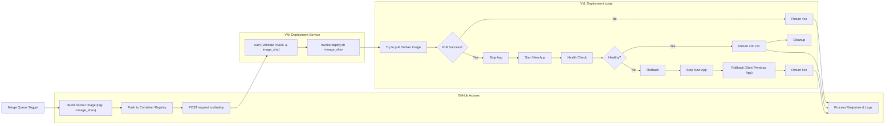

# Deployment

This document outlines the end-to-end flow for automatic on-premises deployment using GitHub Actions, Docker Compose, and a secured FastAPI deployment endpoint. It ensures minimal downtime by stopping only the target service after the new image is pre-pulled, with automatic rollback on failures.

## Workflow diagram



## Steps Description

### 1. Merge Queue Trigger

- A pull request merged through the repository’s merge queue triggers the deployment workflow.

### 2. GitHub Actions

#### **Build & Push Docker Image**

- Builds the Docker image tagged with the commit sha:
    `ghcr.io/mrlvsb/kelvin:${{ github.sha }}`
- Authenticates and pushes the image to the container registry.

#### **Call Deployment Endpoint**

- Computes an HMAC signature over the GitHub event payload using `WEBHOOK_SECRET`.
- Sends a `POST` request to the VM’s `/deploy` with the `X-Hub-Signature-256` header and `image_sha` in request body.
- Uses `curl -f` to fail the Action on any non-200 response.


### 3. VM: FastAPI Deployment Endpoint

- A secure FastAPI service running over HTTPS.
- Validates the HMAC signature and the required `image_sha` request body.
- Invokes the deployment script:
    ```bash
    deploy.sh <SHA>
    ```

### 4. VM: Deployment Script

#### **1. Pre-Pull Image**

- Sets the image tag:
    ```bash
    IMAGE_TAG=<SHA>
    ```
- Pulls the new image:
    ```bash
    docker-compose pull service_name
    ```
- If the pull fails:
    - Immediately returns a `4xx` response and exits without stopping the current service.

#### **2. Swap Service**

- If the pull succeeds:
    1. Stops the running service:
         ```bash
         docker-compose stop service_name
         ```
    2. Starts the updated container (without dependencies):
         ```bash
         docker-compose up -d --no-deps service_name
         ```

#### **3. Health Check**

- Validates the service's health using one of the following methods:
    - **Docker health status**:
        ```bash
        docker inspect --format='{{.State.Health.Status}}' service_name
        ```
    - **HTTP health probe** to verify the service's readiness.

- **If healthy**:
    - Returns `200 OK`.
    - Removes the old container:
        ```bash
        docker-compose rm -f service_name
        ```

- **If unhealthy**:
    - Rolls back by stopping the new container and restarting the previous version:
        ```bash
        docker-compose stop service_name
        docker-compose up -d --no-deps service_name@previous_tag
        ```
    - Returns a `5xx` response.

### 5. GitHub Actions: Process Response & Logs

- Receives the HTTP response from the FastAPI deployment endpoint.
- Logs the result and determines whether to mark the workflow as passed or failed.
