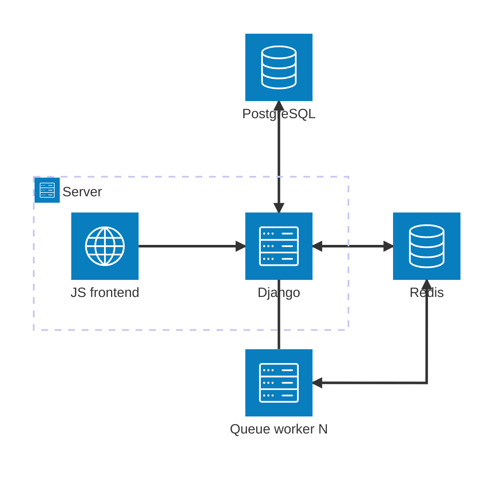

Kelvin consists of several interconnected services:

- **Kelvin web**
  - Django 4 application that provides a REST API and also a set of user-facing web pages and templates
  - It renders some part of the web using a JavaScript frontend
- **JavaScript frontend**
  - Reactive frontend implemented using Svelte 3 and Vue.js, which is rendered into a single JS and CSS file
  and served by the Django app.
- **PostgreSQL database**
  - Provides persistent storage of users, classes, subjects etc. for the web
- **Redis**
  - Provides a temporary (non-persistent) cache used for e.g. storing code plagiarism detection
    check results

The web also uses RQ (Redis) queues for executing various jobs. There are multiple queues:

- `default` queue performs jobs related to common asynchronous stuff, like:
  - Code plagiarism detection
  - LLM code submission review
- `evaluator` queue performs evaluations of code submitted by students
  - The evaluation logic is implemented in the `evaluator` directory
  - It uses Docker internally to perform various evaluation pipelines
- `cuda` queue also performs evaluation, but it should be used for code that needs an NVIDIA GPU

Here is a simple diagram that describes the architecture:



## Directory structure

```
kelvin
├── api - REST API of the backend
├── deploy - automatic docker deployment
├── docs - project documentation site
├── evaluator - evaluation pipelines for checking submitted code
│   ├── images - docker images for custom pipeline actions
│   └── pipelines.py - integrated pipeline actions - e.g. Docker evaluation
│── frontend - JavaScript frontend
├── kelvin - base configuration of the application
├── quiz - module for create quizes as tasks
├── survey - module for creating surveys defined in yaml
└── web - web interface for the kelvin web app
```
