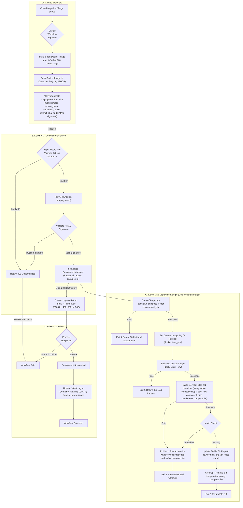

This document outlines the end-to-end flow for automatic on-premises deployment using GitHub Actions, Docker Compose,
and a FastAPI deployment endpoint, and Git show to ensure that service configurations are versioned and deployed
atomically with the code. It ensures minimal downtime by stopping only the target service after the new image is
pre-pulled, with automatic rollback on failures.

## Workflow diagram

## A. Merge Queue Trigger

- A pull request merged through the repository’s merge queue triggers the deployment workflow.

## B. GitHub Workflow

### 1. Build & Push Docker Image

- Builds the Docker image and tags it with the unique commit SHA: `ghcr.io/mrlvsb/<service_name>:${{ github.sha }}`.
- Pushes the tagged image to the GitHub Container Registry (GHCR). At this point, the latest tag is not touched.

### 2. Call Deployment Endpoint

- Computes an HMAC signature over the GitHub event payload using `WEBHOOK_SECRET`.
- Sends a `POST` request to the Kelvin VM’s `/deployment/` with the `X-Hub-Signature-256` header.
  Information about the JSON body can be found at `deployment_service/app/models.py` in class `DeploymentRequest`:
- The workflow fails immediately on any non-200 response.

## C. Kelvin VM: Deployment Service

The deployment endpoint is a small, secure, and separate FastAPI service. It is designed with a clear separation of
concerns and runs within its own Docker container.

### 1. Reverse Proxy (Nginx) & IP Whitelisting

The deployment service depends on a Reverse Proxy (Nginx), which acts as the single public-facing entry point on the server.
For valid requests, Nginx routes them internally to the Deployment Service.

### 2. Deployment Service Container & HMAC Validation

This lightweight container runs the FastAPI endpoint. To manage deployments, it uses the `Docker-out-of-Docker` (DooD) concept:
the host's Docker socket (`/var/run/docker.sock`) is mounted as a volume into this container. This allows script to issue `docker`
and `docker compose` commands directly to the host's Docker daemon. As a second layer of security, this service validates the HMAC
signature from the request header. If the signature is invalid, it returns a `401 Unauthorized` error.

### 3. Invoke Deployment Logic

Upon successful validation, the service instantiates a `DeploymentManager`, passing it the request parameters.
This class encapsulates the entire deployment and rollback logic.

### 4. Stream Logs & Return Status

The service captures all logs generated by the DeploymentManager and includes them in the final HTTP response.
This provides full visibility for debugging and returns the final status code from the process (e.g., `200`, `400`, `500`, `502`).

## D. Kelvin VM: Deployment Script

The core of the process uses a temporary candidate compose file to ensure the deployment is atomic and that the configuration
(e.g., `docker-compose.yml`) perfectly matches the deployed code version.

### 1. Create Temporary Candidate Compose File

To avoid disrupting the stable configuration, the manager first creates a temporary directory and checks out the docker-compose.yml from
the specified commit_sha into it using git show. This isolates the new configuration files for the upcoming deployment.

### 2. Capture Rollback State & Pull New Image

- The logic inspects the currently running application container to get its exact image tag. This tag is stored as a reliable rollback target.
- It then pulls the new image from the container registry. If the pull fails (e.g., image not found), it exits with a 400 Bad Request status
  without affecting the running service.

### 3. Swap Service

- The service swap is performed using two different configurations:
    1. **Stop**: `docker compose stop <service_name>` is run against the stable (current) `docker-compose.yml` file.
    2. **Start**: `docker compose up -d --no-deps <service_name>` is run against the `docker-compose.yml` file in the temporary candidate compose file.
       The new image tag is passed as an environment variable (`<SERVICE_NAME>_IMAGE_TAG`) to the command.

### 4. Health Check

The manager performs an active health check by repeatedly sending HTTP GET requests to a specified `healthcheck_url` or by using the Docker healthcheck (if the `healthcheck_url` is not specified).
It continuously polls this endpoint until it receives a 200 OK status code or docker container status changes to `healthy`, which indicates the service is ready.

The timeout for this check defaults to **90 seconds** (configurable via `health_check_timeout` in `config.py`). It can also be overridden per-request by providing a `health_check_timeout` in the deployment payload. If the health check times out, it triggers a rollback.

### 5. Rollback (on Failure)

- If the service fails to start or the health check times out,the logic initiates a rollback by calling the swap logic again, but in
  reverse: it uses the stable `docker-compose.yml` and overrides the image tag with the previous image tag captured in step 2.
- The workflow fails with a 502 Bad Gateway response, indicating a successful rollback.

### 6. Finalize & Cleanup (on Success)

- If healthy:
  - The deployment is now considered successful. To make the state persistent, the stable Git repository directory is updated to the new state using `git reset --hard <commit_sha>`.
  - The old Docker image is removed to free up resources.
  - The temporary candidate compose file is removed.
  - The service returns 200 OK.

## D. GitHub Workflow

The GitHub Actions workflow waits for the HTTP response from the Kelvin Deployment Service.

- A `200 OK` response confirms a successful deployment. The workflow proceeds to update the `latest` tag in GHCR
  to point to the newly deployed image and marks the run as successful.
- Any other status code (`4xx` or `5xx`) marks the workflow as failed. The detailed logs returned from the deployment
  service are printed to the workflow output for diagnostics.
